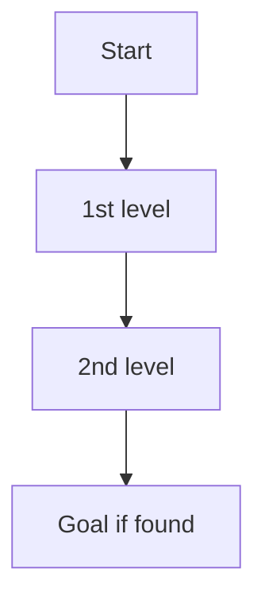
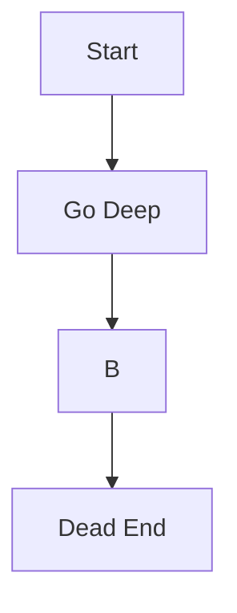
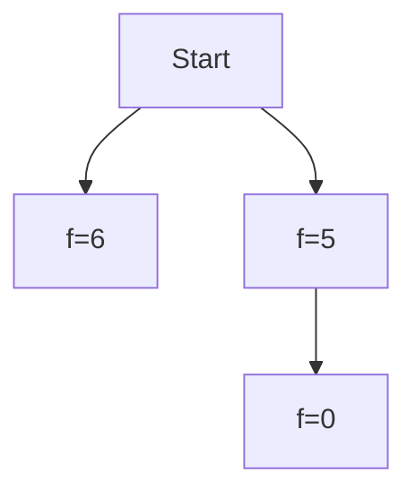
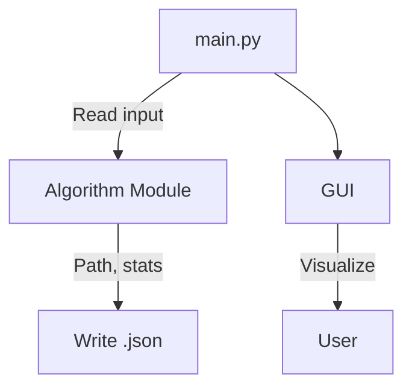

# Technical Report: AI Search in Sliding Tile Puzzle

---

## 📘 Project Overview

This project applies classical AI search algorithms to the **Sliding Tile Puzzle** (e.g., 3x3 or 4x4) to analyze and visualize the behavior of **Breadth-First Search (BFS)**, **Depth-First Search (DFS)**, and **A\***. The system includes a back-end solver and a graphical user interface (GUI) built with Pygame, supporting visualization, benchmarking, and reporting. The goal is to deepen understanding of search algorithms through implementation, visualization, and structured analysis.

---

## a. 🔍 Problem Modeling

### State Space / State Definition
- A **state** is a flat list representing the tile configuration. For a 3x3 board: `[1, 2, 3, 4, 5, 6, 7, 8, 0]`
- **Total possible states**: `(N^2)!` for size N×N (e.g., `9! = 362,880` for 3x3)
- Only **half** of those are solvable. Solvability is based on inversion counts and blank row position.

### Initial State
- Loaded from `data/input/*.json`. Defined as a 1D list.

### Actions
- An action corresponds to **moving the blank tile**:
  - Up (`U`), Down (`D`), Left (`L`), Right (`R`)

### Transition Model
- Given a state and an action, a new state is generated by swapping 0 with a neighbor.
- Defined in `utils/move.py`

### Goal State
- Usually `[1, 2, 3, 4, 5, 6, 7, 8, 0]`, but customizable per puzzle.

### Action Cost
- Each move has a **uniform cost** of `1`.

---

## b. 📚 Algorithm Principles

### Breadth-First Search (BFS)
- Explores all neighbors level by level
- Guarantees **optimal solution** if cost is uniform

### Depth-First Search (DFS)
- Explores deep paths first
- Uses less memory but may not find the optimal solution

### A* Search
- Uses: `f(n) = g(n) + h(n)` where:
  - `g(n)` = cost to reach node n
  - `h(n)` = estimated cost to goal (Manhattan distance)
- Optimal if `h` is admissible

---

## c. ⚙️ Program Flow

### Module Responsibilities
| Module       | Description                            |
|--------------|----------------------------------------|
| `main.py`    | CLI runner for all algorithms          |
| `algorithms/`| BFS, DFS, A* implementations           |
| `utils/`     | State validation, movement, helpers    |
| `gui.py`     | Pygame visualization engine            |
| `report.py`  | Aggregates all results into CSV report |

---

## d. 📊 Algorithm Comparison

### Theoretical Comparison
| Algorithm | Time Complexity    | Space Complexity | Complete | Optimal |
|-----------|--------------------|------------------|----------|---------|
| BFS       | `O(b^d)`           | `O(b^d)`         | ✅       | ✅      |
| DFS       | `O(b^m)`           | `O(m)`           | ❌       | ❌      |
| A*        | `O(b^d)` (best-case)| `O(b^d)`        | ✅       | ✅ (if h admissible) |

### Empirical Results (Sample)

From `report.csv`:

| Puzzle               | Algorithm | Heuristic | Status       | Moves | Time (s) | Space | Expanded |
|----------------------|-----------|-----------|--------------|-------|----------|--------|----------|
| simple_3x3           | BFS       | None      | Path found   | 4     | 0.0012   | 43     | 21       |
| simple_3x3           | DFS       | None      | Path found   | 6     | 0.0008   | 33     | 17       |
| simple_3x3           | A*        | Manhattan | Path found   | 4     | 0.0006   | 28     | 16       |
| unsolvable_3x3       | BFS       | None      | Unsolvable   | 0     | 0.0001   | 1      | 0        |

---

## e. 🚧 Limitations and Future Work

### Challenges Encountered
- DFS was fast but often returned suboptimal paths or got stuck in loops without depth limit
- A* performed well but used more memory on larger puzzles
- GUI only supports keyboard navigation (no sliders/menus yet)

### Future Improvements
- Add more heuristics: Linear Conflict, Pattern Database
- Implement IDA*, Greedy Best-First Search
- Add a real-time heatmap of expanded states
- Refactor GUI to include dropdown selection, search progress bar
- Export replay as video or GIF

---

## ✅ Conclusion

This project successfully implemented and visualized classical AI search algorithms on a real-world problem. The code is modular, testable, and extensible. Results show that A* with Manhattan is the most efficient and optimal under the uniform cost assumption. The GUI helps make abstract algorithms more tangible and explainable to users.
