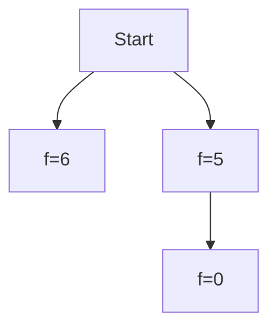
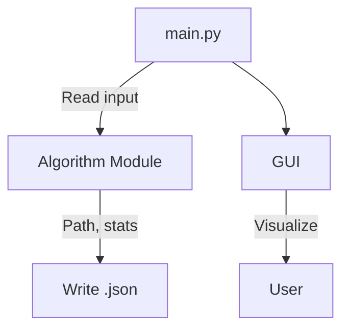

# Technical Report: AI Search in Sliding Tile Puzzle

---

## 📘 Project Overview

This project applies classical AI search algorithms to the **Sliding Tile Puzzle** (e.g., 3x3 or 4x4) to analyze and visualize the behavior of **Breadth-First Search (BFS)**, **Depth-First Search (DFS)**, and **A\***. The system includes a back-end solver and a graphical user interface (GUI) built with Pygame, supporting visualization, benchmarking, and reporting. The goal is to deepen understanding of search algorithms through implementation, visualization, and structured analysis.

---

## a. 🔍 Problem Modeling

### State Space / State Definition
Talk about:
- State space, and half solvable
- Solvability and parity check
- Reference: https://webdocs.cs.ualberta.ca/~hayward/396/hoven/4stile.pdf

- A **state** is a flat list representing the tile configuration. For a 3x3 board: `[1, 2, 3, 4, 5, 6, 7, 8, 0]`
- **Total possible states**: `(N^2)!` for size N×N (e.g., `9! = 362,880` for 3x3)
- Only **half** of those are solvable. Solvability is based on inversion counts and blank row position.

### Initial State
- Loaded from `data/input/*.json`. Defined as a 1D list.

### Actions
- An action corresponds to **moving the blank tile**:
  - Up (`U`), Down (`D`), Left (`L`), Right (`R`)

### Transition Model
- Given a state and an action, a new state is generated by swapping 0 with a neighbor.
- Defined in `utils/move.py`

### Goal State
- Usually `[1, 2, 3, 4, 5, 6, 7, 8, 0]`, but customizable per puzzle.

### Action Cost
- Each move has a **uniform cost** of `1`.

---

## b. 📚 Algorithm Principles

Exhaustive Search (also called Brute Force Search) explores all possible configurations or paths in the search space until a solution is found.
- **Very slow** and **memory-consuming** for large puzzles like 15-puzzle due to combinatorial explosion.
- Not intelligent or **guided**. (e.g. UCS)
- Doesn’t use **heuristics**, so it wastes time on unlikely paths. (e.g. A*)

Random walk is so much slower than BFS and DFS that we will ignore it for this problem. Both BFS and DFS are exhaustive so they will solve the problem, however it may take too long.
- Give the table of dimension and number of states
- Show runtime analysis if possible

BFS takes too long to solve a 4x4 puzzle so we need a faster algorithm. Why use BFS? To get the shortest solution. DFS will ignore many moves at each stage. How can we solve a 4x4 puzzle in a reasonable amount of time? Is there a way to tell which moves are more promising than other moves?
- Special Purpose Algorithms
- Uniform-cost search, named in AI community (or Dijkstra’s Algorithm, in CS community)
- Heuristic search

### Breadth-First Search (BFS)

An appropriate strategy for our problem, when all actions have the same cost, is **breadth-first search**.

Once we’ve reached a state, we can never find a better path to the state. That also means we can do an **early goal test** (check for a solution as soon as it is generated), rather than the **late goal test** (wait until a node is expanded) that *best-first search* uses.

Performance:
- Completeness: This is a systematic search strategy that is therefore complete even on infinite state spaces.
- Optimality: BFS find a solution with minimal number of actions, therefore, it is cost optimal for our problem, where all actions have the same cost. Otherwise, it is not optimal if it does not have this property.

### Depth-First Search (DFS)

Depth-first search always expands the deepest node in the frontier first.

Bad news:
- For acyclic state spaces, it may end up expanding the same state many times for acyclic state spaces. In cyclic state spaces it can get stuck in an infinite loop; therefore some implementations of depth-first search check each new node for cycles.
- In infinite state spaces, depth-first search is not systematic: it can get stuck going down an infinite path.

Why would anyone consider using depth-first search rather than breadth-first or best-first?
- Where a tree-like search is feasible, depth-first search has much smaller needs for memory.
- We don’t keep a reached table at all, and the frontier is very small.

Conclusion, our problem is not the best place for BFS, because of the finite and cyclic state spaces. Therefore, we use graph search instead of tree-like search for our problem.

Peformance:
- Completeness: Yes, for finite state space, and graph search to avoid loop.
- Optimality: No, return the first found solution.

### Depth-limited Search and Iterative Deepening DFS (IDDFS)

### Uniform-cost search (UCS) or Dijkstra’s algorithm

When actions have different costs, an obvious choice is to use best-first search.

For our problem, it is, however, the same as BFS when action costs are equal. In this case, UCS is inefficient because of priority queue. A first-in-first-out queue will be faster than a priority queue, and will give us the correct order of nodes: new nodes go to the back of the queue, and old nodes get expanded first.

This is called **Dijkstra’s algorithm** by the theoretical computer science community, and **uniform-cost search** by the AI community.

The idea is that while breadth-first search spreads out in waves of uniform depth—first depth 1, then depth 2, and so on—uniform-cost search spreads out in waves of uniform path-cost. Note that if we had checked for a goal upon generating a node rather than when expanding the lowest-cost node, then we would have returned a higher-cost path.

Performance: Uniform-cost search is complete and is cost-optimal, because the first solution it finds will have a cost that is at least as low as the cost of any other node in the frontier.
- Completeness: Yes
- Optimality: Yes

### A* Search
- Uses: `f(n) = g(n) + h(n)` where:
  - `g(n)` = cost to reach node n
  - `h(n)` = estimated cost to goal (Manhattan distance)
- Optimal if `h` is admissible

---

## c. ⚙️ Program Flow

### Module Responsibilities
| Module       | Description                            |
|--------------|----------------------------------------|
| `main.py`    | CLI runner for all algorithms          |
| `algorithms/`| BFS, DFS, A* implementations           |
| `utils/`     | State validation, movement, helpers    |
| `gui.py`     | Pygame visualization engine            |
| `report.py`  | Aggregates all results into CSV report |

---

## d. 📊 Algorithm Comparison

### Theoretical Comparison
| Algorithm | Time Complexity    | Space Complexity | Complete | Optimal |
|-----------|--------------------|------------------|----------|---------|
| BFS       | `O(b^d)`           | `O(b^d)`         | ✅       | ✅      |
| DFS       | `O(b^m)`           | `O(m)`           | ❌       | ❌      |
| A*        | `O(b^d)` (best-case)| `O(b^d)`        | ✅       | ✅ (if h admissible) |

### Empirical Results (Sample)

From `report.csv`:

| Puzzle               | Algorithm | Heuristic | Status       | Moves | Time (s) | Space | Expanded |
|----------------------|-----------|-----------|--------------|-------|----------|--------|----------|
| simple_3x3           | BFS       | None      | Path found   | 4     | 0.0012   | 43     | 21       |
| simple_3x3           | DFS       | None      | Path found   | 6     | 0.0008   | 33     | 17       |
| simple_3x3           | A*        | Manhattan | Path found   | 4     | 0.0006   | 28     | 16       |
| unsolvable_3x3       | BFS       | None      | Unsolvable   | 0     | 0.0001   | 1      | 0        |

---

## e. 🚧 Limitations and Future Work

### Challenges Encountered
- DFS was fast but often returned suboptimal paths or got stuck in loops without depth limit
- A* performed well but used more memory on larger puzzles
- GUI only supports keyboard navigation (no sliders/menus yet)

### Future Improvements
- Add more heuristics: Linear Conflict, Pattern Database
- Implement IDA*, Greedy Best-First Search
- Add a real-time heatmap of expanded states
- Refactor GUI to include dropdown selection, search progress bar
- Export replay as video or GIF

---

## ✅ Conclusion

This project successfully implemented and visualized classical AI search algorithms on a real-world problem. The code is modular, testable, and extensible. Results show that A* with Manhattan is the most efficient and optimal under the uniform cost assumption. The GUI helps make abstract algorithms more tangible and explainable to users.
